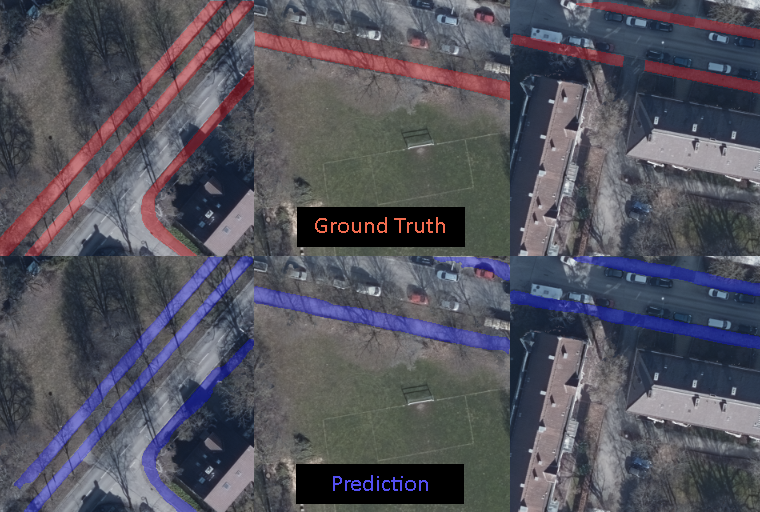

# Sidewalk Width Extractor


[]() []() []()


A demonstration library for sidewalk width extraction from aerial orthophotos using neural network architectures.

# Features

- Resumable Training and Validation
- Resumable Hyper-paramter Tuning
- Automatic checkpoint saving and loading.
- Automatic metric logging via Tensorboard.
- Automatic prediction image saving during the training.

# Setup
---

```bash
pip install git+https://github.com/idp-tum/sidewalk-width-extractor.git@main
```

# Instructions

Create a dataset and modify a config file accordingly (See *configs* folder).

## Training

```bash
python .\scripts\train.py --config="configs\train.json"
```

## Hyper-parameter Tuning

```bash
python .\scripts\tune.py --config="configs\tune.json"
```
